# Ezicons 👩‍💻
Simplify icon integration! Ezicons: Your go to place for seamless icon usage anywhere, from GitHub ReadMe to websites. 🎉🖼️ #Ezicons


With over 300+ icons 🤯 to choose from!


### Features
* Set icon size
* Set icons gap
* Set icons per line

### Integrating icons

Copy and paste the code block below into your readme to add the skills icon element!

Change the ?icons=javascript,html,css to a list of your desired icons seprated by ","s! You can find a full list of icons in the table given below.
You can also specify gaps between icons, height and width of icon & icons per line as shown below.

```md

```


You can make use of the optional arguments gap,perLine and dimension each of them is set to a default value of 8px,15 and 48px respectively.

```md

```


You can also integrate icons into your website by using the img tag and setting the source to the desired icons url.

```html

```

### All Icons


| Icon ID | Icon |
| ------- | ---- |
| `skills-dark-adobe` |  |
| `skills-dark-ae` |  |
| `skills-dark-ai` |  |
| `skills-dark-airtable` |  |
| `skills-dark-amazonwebservices` |  |
| `skills-dark-analytics` |  |
| `skills-dark-android` |  |
| `skills-dark-angular` |  |
| `skills-dark-apache` |  |
| `skills-dark-astro` |  |
| `skills-dark-atlassian` |  |
| `skills-dark-auth0` |  |
| `skills-dark-aws-ec2` |  |
| `skills-dark-aws` |  |
| `skills-dark-axure` |  |
| `skills-dark-azure` |  |
| `skills-dark-babel` |  |
| `skills-dark-backbonejs` |  |
| `skills-dark-bitbucker` |  |
| `skills-dark-bootstrap` |  |
| `skills-dark-bootstrap4` |  |
| `skills-dark-bootstrap5` |  |
| `skills-dark-bulma-ui` |  |
| `skills-dark-c#` |  |
| `skills-dark-c++` |  |
| `skills-dark-cakephp` |  |
| `skills-dark-chrome` |  |
| `skills-dark-clojure` |  |
| `skills-dark-cloudinary` |  |
| `skills-dark-codeigniter` |  |
| `skills-dark-crystal` |  |
| `skills-dark-css` |  |
| `skills-dark-digitalocean` |  |
| `skills-dark-django` |  |
| `skills-dark-dlang` |  |
| `skills-dark-docker` |  |
| `skills-dark-dovetail-1` |  |
| `skills-dark-dovetail` |  |
| `skills-dark-edge` |  |
| `skills-dark-electron` |  |
| `skills-dark-element-ui` |  |
| `skills-dark-elixir` |  |
| `skills-dark-ember` |  |
| `skills-dark-eslint` |  |
| `skills-dark-faunadb` |  |
| `skills-dark-figma` |  |
| `skills-dark-firebase` |  |
| `skills-dark-firefox` |  |
| `skills-dark-flask` |  |
| `skills-dark-flutter` |  |
| `skills-dark-framer` |  |
| `skills-dark-gatsby` |  |
| `skills-dark-git` |  |
| `skills-dark-github` |  |
| `skills-dark-gitlab` |  |
| `skills-dark-go` |  |
| `skills-dark-google-cloud` |  |
| `skills-dark-graphql` |  |
| `skills-dark-gridsome` |  |
| `skills-dark-gulp` |  |
| `skills-dark-haskell` |  |
| `skills-dark-heroku` |  |
| `skills-dark-hexo` |  |
| `skills-dark-hotjar` |  |
| `skills-dark-html5` |  |
| `skills-dark-id` |  |
| `skills-dark-ie` |  |
| `skills-dark-inkspace` |  |
| `skills-dark-insomnia` |  |
| `skills-dark-invision` |  |
| `skills-dark-ionic` |  |
| `skills-dark-jamstack` |  |
| `skills-dark-java` | 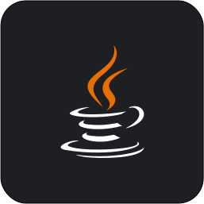 |
| `skills-dark-jest` |  |
| `skills-dark-jira` |  |
| `skills-dark-jquery` |  |
| `skills-dark-js` |  |
| `skills-dark-json` |  |
| `skills-dark-kotlin` |  |
| `skills-dark-kubernetes` |  |
| `skills-dark-laravel` |  |
| `skills-dark-less` |  |
| `skills-dark-linux` |  |
| `skills-dark-logrocket` |  |
| `skills-dark-lua` |  |
| `skills-dark-lunacy` |  |
| `skills-dark-material-ui` |  |
| `skills-dark-microsoft` |  |
| `skills-dark-mochajs` |  |
| `skills-dark-mongodb` |  |
| `skills-dark-mozilla` |  |
| `skills-dark-mysql` |  |
| `skills-dark-nestjs` | 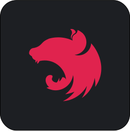 |
| `skills-dark-netlify-new` |  |
| `skills-dark-netlify` |  |
| `skills-dark-nextjs` |  |
| `skills-dark-nextjs2` |  |
| `skills-dark-nim` |  |
| `skills-dark-nodejs` |  |
| `skills-dark-npm` |  |
| `skills-dark-nuxtjs` |  |
| `skills-dark-ocaml` |  |
| `skills-dark-onedrive` |  |
| `skills-dark-openai` |  |
| `skills-dark-oracle` |  |
| `skills-dark-php` |  |
| `skills-dark-postfresql` |  |
| `skills-dark-postman` |  |
| `skills-dark-powershell` |  |
| `skills-dark-prettier` | 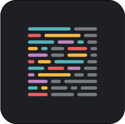 |
| `skills-dark-prisma` |  |
| `skills-dark-ps` |  |
| `skills-dark-pugjs` |  |
| `skills-dark-pwa` |  |
| `skills-dark-python` |  |
| `skills-dark-rails` |  |
| `skills-dark-react-query-1` |  |
| `skills-dark-react-query` |  |
| `skills-dark-reactjs` |  |
| `skills-dark-redhat` |  |
| `skills-dark-redis` |  |
| `skills-dark-redux` |  |
| `skills-dark-ruby` |  |
| `skills-dark-rust` |  |
| `skills-dark-sass` |  |
| `skills-dark-scala` |  |
| `skills-dark-semantic-ui` |  |
| `skills-dark-serverless` |  |
| `skills-dark-sketch-new` | 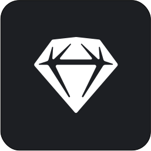 |
| `skills-dark-sketch` |  |
| `skills-dark-solidity` |  |
| `skills-dark-spring` |  |
| `skills-dark-storyblok` |  |
| `skills-dark-storybook` |  |
| `skills-dark-stream` |  |
| `skills-dark-sublime` |  |
| `skills-dark-sveltejs` |  |
| `skills-dark-swift` |  |
| `skills-dark-tailwind` |  |
| `skills-dark-trpc` |  |
| `skills-dark-typescript` |  |
| `skills-dark-ubuntu` |  |
| `skills-dark-ur` |  |
| `skills-dark-vim` |  |
| `skills-dark-visualbasic` |  |
| `skills-dark-vitejs` |  |
| `skills-dark-vitest` |  |
| `skills-dark-vs` |  |
| `skills-dark-vuejs` |  |
| `skills-dark-webassembly` |  |
| `skills-dark-webpack` |  |
| `skills-dark-wordpress` |  |
| `skills-dark-xamarin` |  |
| `skills-dark-xd` |  |
| `skills-dark-zod` |  |
| `skills-grayscale-adobe` |  |
| `skills-grayscale-ae` |  |
| `skills-grayscale-ai` |  |
| `skills-grayscale-airtable` |  |
| `skills-grayscale-amazonwebservices` |  |
| `skills-grayscale-analytics` |  |
| `skills-grayscale-android` |  |
| `skills-grayscale-angular` |  |
| `skills-grayscale-apache` |  |
| `skills-grayscale-astro` |  |
| `skills-grayscale-atlassian` |  |
| `skills-grayscale-auth0` |  |
| `skills-grayscale-aws-ec2` |  |
| `skills-grayscale-aws` |  |
| `skills-grayscale-axure` |  |
| `skills-grayscale-azure` |  |
| `skills-grayscale-babel` |  |
| `skills-grayscale-backbonejs` |  |
| `skills-grayscale-bitbucker` |  |
| `skills-grayscale-bootstrap` |  |
| `skills-grayscale-bootstrap4` |  |
| `skills-grayscale-bootstrap5` |  |
| `skills-grayscale-bulma-ui` |  |
| `skills-grayscale-c#` |  |
| `skills-grayscale-c++` |  |
| `skills-grayscale-cakephp` |  |
| `skills-grayscale-chrome` |  |
| `skills-grayscale-cloudinary` |  |
| `skills-grayscale-codeigniter` |  |
| `skills-grayscale-css` |  |
| `skills-grayscale-digitalocean` |  |
| `skills-grayscale-django` |  |
| `skills-grayscale-docker` |  |
| `skills-grayscale-edge` |  |
| `skills-grayscale-electron` |  |
| `skills-grayscale-element-ui` |  |
| `skills-grayscale-ember` |  |
| `skills-grayscale-eslint` |  |
| `skills-grayscale-faunadb` |  |
| `skills-grayscale-figma` |  |
| `skills-grayscale-firebase` |  |
| `skills-grayscale-firefox` |  |
| `skills-grayscale-flask` |  |
| `skills-grayscale-flutter` |  |
| `skills-grayscale-gatsby` |  |
| `skills-grayscale-git` |  |
| `skills-grayscale-github` |  |
| `skills-grayscale-gitlab` |  |
| `skills-grayscale-go` |  |
| `skills-grayscale-google-cloud` |  |
| `skills-grayscale-graphql` |  |
| `skills-grayscale-gridsome` |  |
| `skills-grayscale-gulp` |  |
| `skills-grayscale-heroku` |  |
| `skills-grayscale-hexo` |  |
| `skills-grayscale-hotjar` |  |
| `skills-grayscale-html5` |  |
| `skills-grayscale-id` |  |
| `skills-grayscale-ie` |  |
| `skills-grayscale-insomnia` |  |
| `skills-grayscale-invision` |  |
| `skills-grayscale-ionic` |  |
| `skills-grayscale-jamstack` |  |
| `skills-grayscale-java` |  |
| `skills-grayscale-jest` |  |
| `skills-grayscale-jira` |  |
| `skills-grayscale-jquery` |  |
| `skills-grayscale-js` |  |
| `skills-grayscale-json` |  |
| `skills-grayscale-kotlin` |  |
| `skills-grayscale-laravel` |  |
| `skills-grayscale-linux` |  |
| `skills-grayscale-logrocket` |  |
| `skills-grayscale-lunacy` |  |
| `skills-grayscale-material-ui` |  |
| `skills-grayscale-mochajs` |  |
| `skills-grayscale-mongodb` |  |
| `skills-grayscale-mozilla` |  |
| `skills-grayscale-mysql` |  |
| `skills-grayscale-netlify-new` |  |
| `skills-grayscale-netlify` |  |
| `skills-grayscale-nextjs` |  |
| `skills-grayscale-nextjs2` |  |
| `skills-grayscale-nodejs` |  |
| `skills-grayscale-npm` |  |
| `skills-grayscale-nuxtjs` |  |
| `skills-grayscale-openai` |  |
| `skills-grayscale-php` |  |
| `skills-grayscale-postfresql` |  |
| `skills-grayscale-postman` |  |
| `skills-grayscale-prettier` |  |
| `skills-grayscale-prisma` |  |
| `skills-grayscale-ps` |  |
| `skills-grayscale-pugjs` |  |
| `skills-grayscale-pwa` |  |
| `skills-grayscale-python` |  |
| `skills-grayscale-rails` |  |
| `skills-grayscale-react-query-1` |  |
| `skills-grayscale-react-query` |  |
| `skills-grayscale-reactjs` |  |
| `skills-grayscale-redis` |  |
| `skills-grayscale-redux` |  |
| `skills-grayscale-ruby` |  |
| `skills-grayscale-rust` |  |
| `skills-grayscale-sass` |  |
| `skills-grayscale-semantic-ui` |  |
| `skills-grayscale-serverless` |  |
| `skills-grayscale-sketch-new` |  |
| `skills-grayscale-sketch` |  |
| `skills-grayscale-solidity` |  |
| `skills-grayscale-storyblok` |  |
| `skills-grayscale-storybook` |  |
| `skills-grayscale-stream` |  |
| `skills-grayscale-sublime` |  |
| `skills-grayscale-sveltejs` |  |
| `skills-grayscale-swift` |  |
| `skills-grayscale-tailwind` |  |
| `skills-grayscale-trpc` |  |
| `skills-grayscale-typescript` |  |
| `skills-grayscale-ubuntu` |  |
| `skills-grayscale-vitejs` |  |
| `skills-grayscale-vitest` |  |
| `skills-grayscale-vs` |  |
| `skills-grayscale-vuejs` |  |
| `skills-grayscale-webpack` |  |
| `skills-grayscale-wordpress` |  |
| `skills-grayscale-xd` |  |
| `skills-grayscale-zod` |  |
| `skills-light-adobe` |  |
| `skills-light-ae` |  |
| `skills-light-ai` |  |
| `skills-light-airtable` | 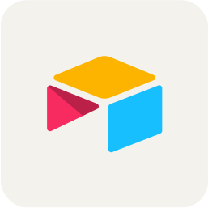 |
| `skills-light-alpinejs` | 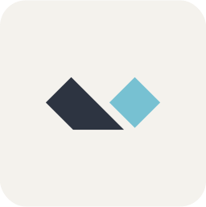 |
| `skills-light-amazonwebservices` | 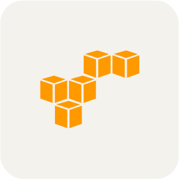 |
| `skills-light-analytics` |  |
| `skills-light-android` |  |
| `skills-light-angular` |  |
| `skills-light-apache` |  |
| `skills-light-astro` |  |
| `skills-light-atlassian` | 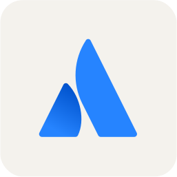 |
| `skills-light-auth0` |  |
| `skills-light-aws-ec2` | 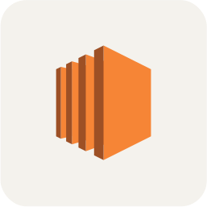 |
| `skills-light-aws` |  |
| `skills-light-axure` | 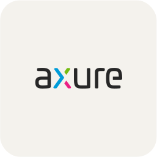 |
| `skills-light-azure` | 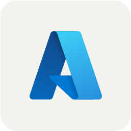 |
| `skills-light-babel` | 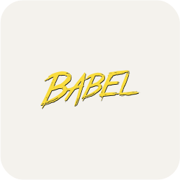 |
| `skills-light-backbonejs` |  |
| `skills-light-bitbucker` |  |
| `skills-light-bootstrap` |  |
| `skills-light-bootstrap4` |  |
| `skills-light-bootstrap5` |  |
| `skills-light-bulma-ui` | 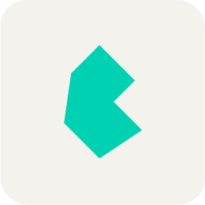 |
| `skills-light-c#` | 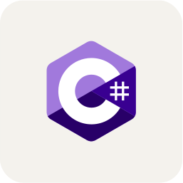 |
| `skills-light-c++` | 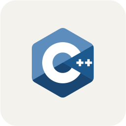 |
| `skills-light-cakephp` | 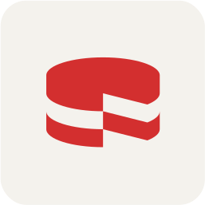 |
| `skills-light-chrome` |  |
| `skills-light-clojure` |  |
| `skills-light-cloudinary` |  |
| `skills-light-codeigniter` |  |
| `skills-light-crystal` |  |
| `skills-light-css3` |  |
| `skills-light-digitalocean` |  |
| `skills-light-django` |  |
| `skills-light-dlang` | 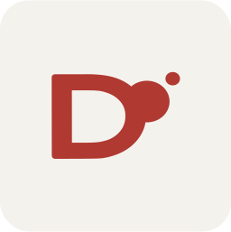 |
| `skills-light-docker` | 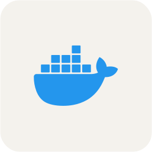 |
| `skills-light-dovetail-1` | 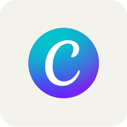 |
| `skills-light-dovetail` |  |
| `skills-light-edge` | 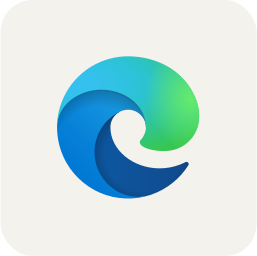 |
| `skills-light-electron` | 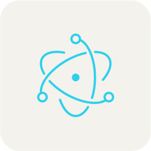 |
| `skills-light-element-ui` |  |
| `skills-light-elixir` |  |
| `skills-light-ember` |  |
| `skills-light-eslint` | 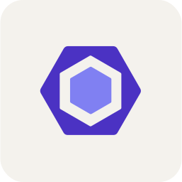 |
| `skills-light-faunadb` | 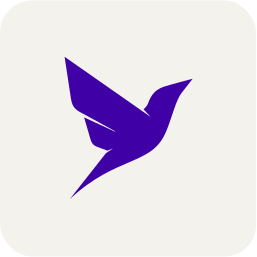 |
| `skills-light-figma` | 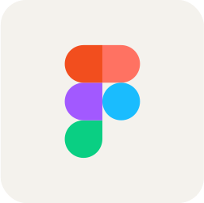 |
| `skills-light-firebase` |  |
| `skills-light-firefox` |  |
| `skills-light-flask` |  |
| `skills-light-flutter` |  |
| `skills-light-framer` |  |
| `skills-light-gatsby` |  |
| `skills-light-git` |  |
| `skills-light-github` | 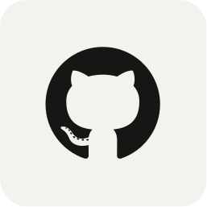 |
| `skills-light-gitlab` |  |
| `skills-light-go` |  |
| `skills-light-google-cloud` |  |
| `skills-light-graphql` |  |
| `skills-light-gridsome` | 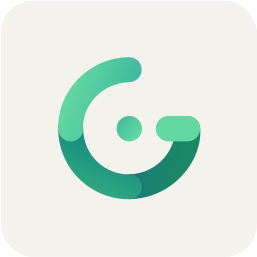 |
| `skills-light-gulp` |  |
| `skills-light-haskell` | 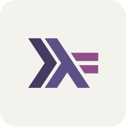 |
| `skills-light-heroku` |  |
| `skills-light-hexo` |  |
| `skills-light-hotjar` |  |
| `skills-light-html5` |  |
| `skills-light-id` |  |
| `skills-light-ie` |  |
| `skills-light-inkspace` | 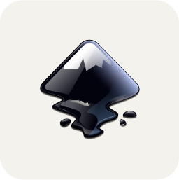 |
| `skills-light-insomnia` |  |
| `skills-light-invision` |  |
| `skills-light-ionic` | 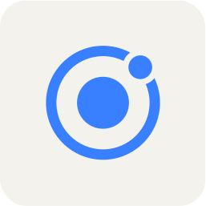 |
| `skills-light-jamstack` | 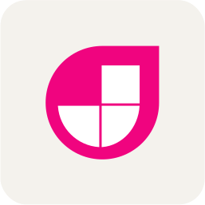 |
| `skills-light-java` | 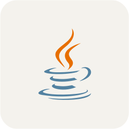 |
| `skills-light-jest` | 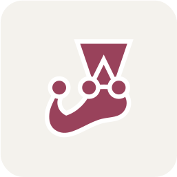 |
| `skills-light-jira` |  |
| `skills-light-jquery` |  |
| `skills-light-js` |  |
| `skills-light-json` | 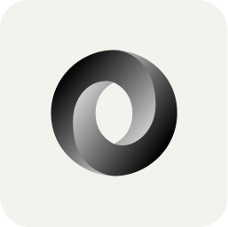 |
| `skills-light-kotlin` |  |
| `skills-light-kubernetes` |  |
| `skills-light-laravel` |  |
| `skills-light-less` |  |
| `skills-light-linux` |  |
| `skills-light-lit` | 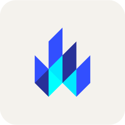 |
| `skills-light-logrocket` |  |
| `skills-light-lua` |  |
| `skills-light-lunacy` |  |
| `skills-light-material-ui` |  |
| `skills-light-microsoft` |  |
| `skills-light-mochajs` |  |
| `skills-light-mongodb` |  |
| `skills-light-mozilla` |  |
| `skills-light-mysql` | 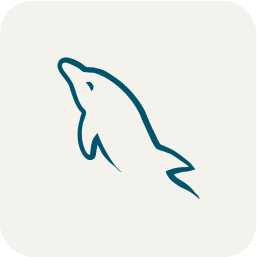 |
| `skills-light-nestjs` |  |
| `skills-light-netlify-new` |  |
| `skills-light-netlify` | 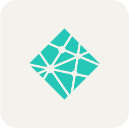 |
| `skills-light-nextjs` |  |
| `skills-light-nextjs2` | 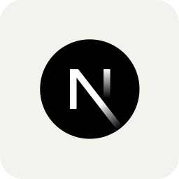 |
| `skills-light-nim` | 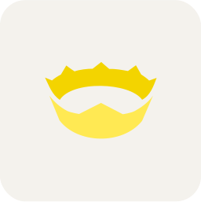 |
| `skills-light-nodejs` | 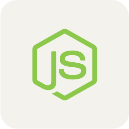 |
| `skills-light-npm` |  |
| `skills-light-nuxtjs` |  |
| `skills-light-ocaml` |  |
| `skills-light-onedrive` |  |
| `skills-light-openai` |  |
| `skills-light-oracle` |  |
| `skills-light-php` |  |
| `skills-light-postfresql` | 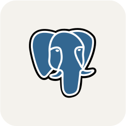 |
| `skills-light-postman` |  |
| `skills-light-powershell` |  |
| `skills-light-prettier` | 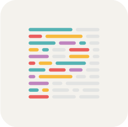 |
| `skills-light-prisma` | 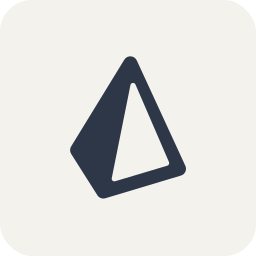 |
| `skills-light-ps` |  |
| `skills-light-pugjs` | 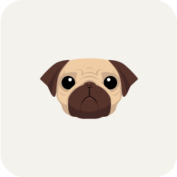 |
| `skills-light-pwa` |  |
| `skills-light-python` |  |
| `skills-light-rails` |  |
| `skills-light-react-query-1` |  |
| `skills-light-react-query` | 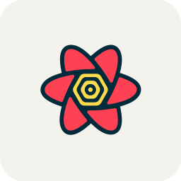 |
| `skills-light-reactjs` |  |
| `skills-light-redhat` |  |
| `skills-light-redis` | 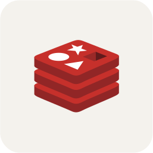 |
| `skills-light-redux` |  |
| `skills-light-ruby` |  |
| `skills-light-rust` | 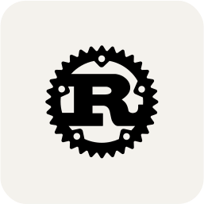 |
| `skills-light-sass` |  |
| `skills-light-scala` |  |
| `skills-light-semantic-ui` |  |
| `skills-light-serverless` |  |
| `skills-light-sketch-new` |  |
| `skills-light-sketch` |  |
| `skills-light-solidity` |  |
| `skills-light-solidjs` |  |
| `skills-light-spring` |  |
| `skills-light-storyblok` |  |
| `skills-light-storybook` |  |
| `skills-light-stream` |  |
| `skills-light-sublime` |  |
| `skills-light-sveltejs` |  |
| `skills-light-swift` |  |
| `skills-light-tailwind` | 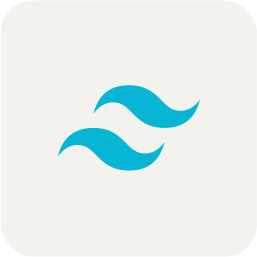 |
| `skills-light-trpc` |  |
| `skills-light-typescript` | 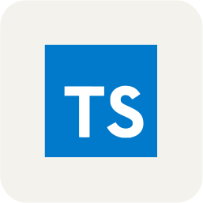 |
| `skills-light-ubuntu` | 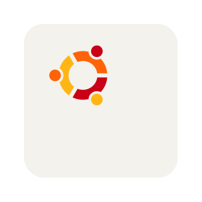 |
| `skills-light-ur` |  |
| `skills-light-vim` |  |
| `skills-light-visualbasic` |  |
| `skills-light-vitejs` |  |
| `skills-light-vitest` |  |
| `skills-light-vs` |  |
| `skills-light-vuejs` |  |
| `skills-light-webassembly` |  |
| `skills-light-webpack` |  |
| `skills-light-wordpress` |  |
| `skills-light-xamarin` |  |
| `skills-light-xd` |  |
| `skills-light-zod` | 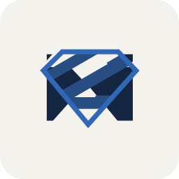 |


